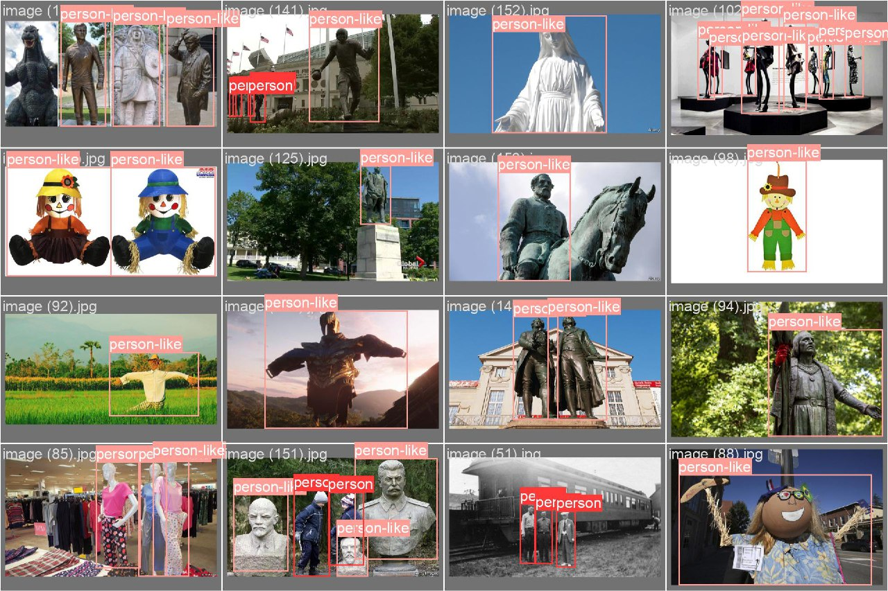

# Object detection using YOLOv5 and Faster R-CNN

This repository contains code and documentation for training and evaluating object detection models using YOLOv5 and Faster R-CNN. The project involves data preparation, model training, validation, and detection processes.
## Table of Contents

- [Installation](#installation)
- [Data Preparation](#data-preparation)
- [Training Models](#training-models)
  - [YOLOv5](#yolov5)
  - [Faster R-CNN](#faster-r-cnn)
- [Validation](#validation)
- [Detection](#detection)
- [Result](#result)


## Installation

Clone the repository and install the required dependencies.

```bash
git clone https://github.com/ultralytics/yolov5
cd yolov5/
pip install -r requirements.txt

```

### Data Preparation

in this stage we convert the annotations of the samples in the dataset to the scale that can be fed to YOLOv5.

```paython

import os
import xml.etree.ElementTree as ET
from glob import glob

def convert_bbox(size, box):
    dw = 1.0 / size[0]
    dh = 1.0 / size[1]
    x = (box[0] + box[2]) / 2.0
    y = (box[1] + box[3]) / 2.0
    w = box[2] - box[0]
    h = box[3] - box[1]
    x = x * dw
    w = w * dw
    y = y * dh
    h = h * dh
    return (x, y, w, h)

def convert_annotation(xml_file, classes):
    tree = ET.parse(xml_file)
    root = tree.getroot()
    size = root.find('size')
    w = int(size.find('width').text)
    h = int(size.find('height').text)

    out_file = xml_file.replace('Annotations', 'labels').replace('.xml', '.txt')
    out_dir = os.path.dirname(out_file)
    if not os.path.exists(out_dir):
        os.makedirs(out_dir)

    with open(out_file, 'w') as out:
        for obj in root.iter('object'):
            cls = obj.find('name').text
            if cls not in classes:
                continue
            cls_id = classes.index(cls)
            xmlbox = obj.find('bndbox')
            b = (float(xmlbox.find('xmin').text), float(xmlbox.find('ymin').text),
                 float(xmlbox.find('xmax').text), float(xmlbox.find('ymax').text))
            bb = convert_bbox((w, h), b)
            out.write(f"{cls_id} {' '.join([str(a) for a in bb])}\n")

def process_dataset(dataset_path):
    classes = set()
    for xml_file in glob(os.path.join(dataset_path, '**/Annotations/*.xml'), recursive=True):
        tree = ET.parse(xml_file)
        root = tree.getroot()
        for obj in root.iter('object'):
            cls = obj.find('name').text
            classes.add(cls)

    classes = sorted(list(classes))

    for xml_file in glob(os.path.join(dataset_path, '**/Annotations/*.xml'), recursive=True):
        convert_annotation(xml_file, classes)

    with open(os.path.join(dataset_path, 'classes.txt'), 'w') as f:
        for cls in classes:
            f.write(f"{cls}\n")

    print("Conversion completed.")

dataset_path = '/path/to/your/dataset'
process_dataset(dataset_path)
```


## Training Models

## YOLOv5

Follow the steps below to train a YOLOv5 model:

1. Clone the YOLOv5 repository.
2. Install the dependencies.

```
git clone https://github.com/ultralytics/yolov5
cd yolov5/
pip install -r requirements.txt
```

3. Run the training script.

```
python train.py --img 640 --batch 16 --epochs 50 --data /path/to/your/data.yaml --weights yolov5s.pt
```

## Faster R-CNN

1. Set up the model and training configuration.
2. Run the training process.

## Validation

Run the validation with the respective validation scripts using models in respective directories.


## Detection

Detection with trained models is done using the provided detection scripts. These scripts are designed to take an image as input and then output detected objects with their corresponding bounding boxes.

## Result

Totally the results show that performance of YOLOv5 was better in comparison to Faster R-CNN .    
<br>
<br>


<div align="center">  </div>

<p align="center">
    <em>Detected objects in the images into person and person-like by YOLOv5.</em>
</p>

